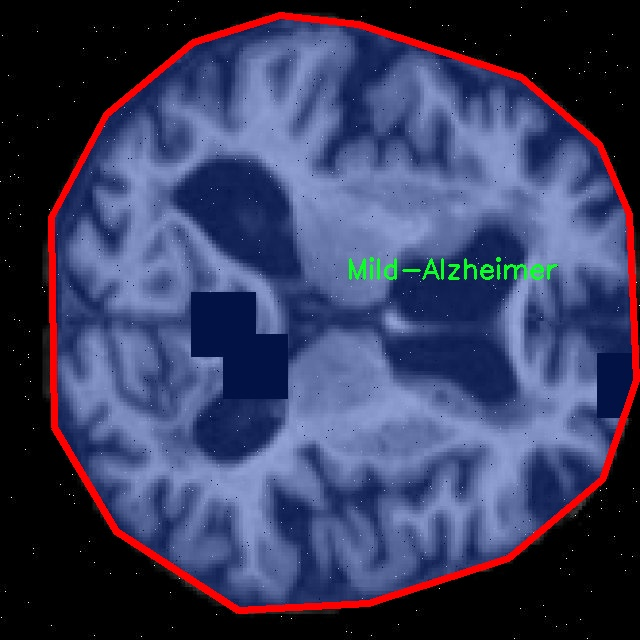

# 阿尔茨海默症图像分割系统源码＆数据集分享
 [yolov8-seg-convnextv2＆yolov8-seg-C2f-RFCBAMConv等50+全套改进创新点发刊_一键训练教程_Web前端展示]

### 1.研究背景与意义

项目参考[ILSVRC ImageNet Large Scale Visual Recognition Challenge](https://gitee.com/YOLOv8_YOLOv11_Segmentation_Studio/projects)

项目来源[AAAI Global Al lnnovation Contest](https://kdocs.cn/l/cszuIiCKVNis)

研究背景与意义

阿尔茨海默症（Alzheimer's Disease, AD）是一种渐进性神经退行性疾病，主要表现为认知功能的逐渐衰退，严重影响患者的日常生活和社会交往。根据世界卫生组织的统计，全球约有5000万阿尔茨海默症患者，预计到2050年这一数字将增至1.52亿。随着人口老龄化的加剧，阿尔茨海默症的发病率逐年上升，已成为全球公共卫生的重要挑战。因此，早期诊断和干预对改善患者的生活质量、减缓疾病进程具有重要意义。

在阿尔茨海默症的诊断过程中，医学影像学，尤其是磁共振成像（MRI），扮演着至关重要的角色。MRI能够提供高分辨率的脑部图像，帮助医生观察脑组织的结构变化。然而，传统的影像分析方法往往依赖于人工观察，容易受到主观因素的影响，且效率较低。因此，开发一种高效、准确的图像分割系统，能够自动识别和分类不同类型的阿尔茨海默症，将极大地推动早期诊断的进程。

近年来，深度学习技术在医学影像分析领域取得了显著进展，尤其是基于卷积神经网络（CNN）的目标检测和图像分割方法。YOLO（You Only Look Once）系列模型因其高效的实时处理能力和较高的准确性，成为了目标检测领域的热门选择。YOLOv8作为该系列的最新版本，进一步提升了模型的性能，尤其在处理复杂背景和小目标检测方面表现出色。然而，针对阿尔茨海默症的MRI图像分割任务，现有的YOLOv8模型仍存在一些不足之处，例如对不同疾病阶段的细微差别识别能力不足。因此，基于改进YOLOv8的阿尔茨海默症图像分割系统的研究具有重要的学术价值和实际意义。

本研究将利用一个包含4000幅MRI图像的数据集，涵盖四个类别：轻度阿尔茨海默症、中度阿尔茨海默症、非阿尔茨海默症和非常轻度阿尔茨海默症。通过对这些图像进行深度学习训练，改进YOLOv8模型的特征提取和分类能力，以实现对不同阿尔茨海默症阶段的准确分割。该系统不仅能够提高图像分割的精度，还能为临床医生提供更为可靠的辅助诊断工具，从而加速患者的治疗决策。

此外，本研究还将探讨改进YOLOv8模型在处理医学影像时的可解释性问题，以便于医生理解模型的决策过程。这一方面将增强医生对AI辅助诊断工具的信任，另一方面也为后续的模型优化提供数据支持。通过构建一个高效、准确且可解释的阿尔茨海默症图像分割系统，本研究不仅为阿尔茨海默症的早期诊断提供了新的技术手段，也为相关领域的研究提供了有价值的参考，推动了医学影像分析技术的发展。

### 2.图片演示


##### 注意：由于此博客编辑较早，上面“2.图片演示”和“3.视频演示”展示的系统图片或者视频可能为老版本，新版本在老版本的基础上升级如下：（实际效果以升级的新版本为准）

  （1）适配了YOLOV8的“目标检测”模型和“实例分割”模型，通过加载相应的权重（.pt）文件即可自适应加载模型。

  （2）支持“图片识别”、“视频识别”、“摄像头实时识别”三种识别模式。

  （3）支持“图片识别”、“视频识别”、“摄像头实时识别”三种识别结果保存导出，解决手动导出（容易卡顿出现爆内存）存在的问题，识别完自动保存结果并导出到tempDir中。

  （4）支持Web前端系统中的标题、背景图等自定义修改，后面提供修改教程。

  另外本项目提供训练的数据集和训练教程,暂不提供权重文件（best.pt）,需要您按照教程进行训练后实现图片演示和Web前端界面演示的效果。

### 3.视频演示

[3.1 视频演示](https://www.bilibili.com/video/BV1W6SvYTEWw/)

### 4.数据集信息展示

##### 4.1 本项目数据集详细数据（类别数＆类别名）

nc: 4
names: ['Mild-Alzheimer', 'Moderate-Alzheimer', 'Non-Alzheimer', 'VeryMild-Alzheimer']


##### 4.2 本项目数据集信息介绍

数据集信息展示

在本研究中，我们使用了名为“MRI - Alzheimer”的数据集，旨在训练和改进YOLOv8-seg模型，以实现阿尔茨海默症图像的高效分割。该数据集专注于不同阶段的阿尔茨海默症患者的脑部MRI图像，包含四个主要类别，分别是“轻度阿尔茨海默症”、“中度阿尔茨海默症”、“非阿尔茨海默症”和“非常轻度阿尔茨海默症”。这些类别的划分不仅反映了疾病的不同发展阶段，也为我们提供了丰富的样本，以便于模型在处理复杂的医学图像时能够更好地进行分类和分割。

“MRI - Alzheimer”数据集的构建基于大量的临床数据，确保了样本的多样性和代表性。每个类别都包含了多种不同的MRI图像，这些图像在成像技术、患者年龄、性别以及其他生理特征上均有所不同。这种多样性使得模型在训练过程中能够学习到不同类型的特征，从而提高其在实际应用中的泛化能力。例如，轻度阿尔茨海默症的图像可能显示出较轻微的脑萎缩，而中度阿尔茨海默症的图像则可能呈现出更明显的结构变化。这种细微的差别对于模型的训练至关重要，因为它要求模型能够捕捉到不同阶段的特征并进行有效的分割。

在数据集的准备过程中，我们对图像进行了预处理，包括归一化、去噪声和增强等操作，以提高图像质量并增加数据的多样性。这些处理步骤旨在消除可能影响模型性能的干扰因素，使得模型能够专注于提取与阿尔茨海默症相关的关键特征。此外，数据集还包含了相应的标注信息，为每一幅图像提供了准确的类别标签。这些标签不仅是模型训练的基础，也是后续评估模型性能的重要依据。

在训练过程中，我们采用了交叉验证的方法，以确保模型在不同数据子集上的表现一致性。通过这种方式，我们能够有效地评估模型的鲁棒性，并减少过拟合的风险。同时，我们还设计了一系列实验，比较不同模型架构和参数设置对分割性能的影响，以便找到最佳的模型配置。

值得注意的是，阿尔茨海默症的早期诊断对于患者的治疗和管理至关重要。通过改进YOLOv8-seg模型，我们希望能够提高对阿尔茨海默症的图像分割精度，从而为临床医生提供更为准确的诊断工具。最终目标是通过这一数据集的应用，推动阿尔茨海默症研究的进展，帮助更多患者获得及时的医疗干预。

总之，“MRI - Alzheimer”数据集为我们提供了一个丰富的资源，使得我们能够在阿尔茨海默症的图像分割研究中取得实质性进展。通过对该数据集的深入分析和应用，我们期望能够为阿尔茨海默症的早期诊断和治疗提供有力支持，推动相关领域的研究与发展。





### 5.全套项目环境部署视频教程（零基础手把手教学）

[5.1 环境部署教程链接（零基础手把手教学）](https://www.bilibili.com/video/BV1jG4Ve4E9t/?vd_source=bc9aec86d164b67a7004b996143742dc)


[5.2 安装Python虚拟环境创建和依赖库安装视频教程链接（零基础手把手教学）](https://www.bilibili.com/video/BV1nA4VeYEze/?vd_source=bc9aec86d164b67a7004b996143742dc)

### 6.手把手YOLOV8-seg训练视频教程（零基础小白有手就能学会）

[6.1 手把手YOLOV8-seg训练视频教程（零基础小白有手就能学会）](https://www.bilibili.com/video/BV1cA4VeYETe/?vd_source=bc9aec86d164b67a7004b996143742dc)


按照上面的训练视频教程链接加载项目提供的数据集，运行train.py即可开始训练



     Epoch   gpu_mem       box       obj       cls    labels  img_size
     1/200     0G   0.01576   0.01955  0.007536        22      1280: 100%|██████████| 849/849 [14:42<00:00,  1.04s/it]
               Class     Images     Labels          P          R     mAP@.5 mAP@.5:.95: 100%|██████████| 213/213 [01:14<00:00,  2.87it/s]
                 all       3395      17314      0.994      0.957      0.0957      0.0843

     Epoch   gpu_mem       box       obj       cls    labels  img_size
     2/200     0G   0.01578   0.01923  0.007006        22      1280: 100%|██████████| 849/849 [14:44<00:00,  1.04s/it]
               Class     Images     Labels          P          R     mAP@.5 mAP@.5:.95: 100%|██████████| 213/213 [01:12<00:00,  2.95it/s]
                 all       3395      17314      0.996      0.956      0.0957      0.0845

     Epoch   gpu_mem       box       obj       cls    labels  img_size
     3/200     0G   0.01561    0.0191  0.006895        27      1280: 100%|██████████| 849/849 [10:56<00:00,  1.29it/s]
               Class     Images     Labels          P          R     mAP@.5 mAP@.5:.95: 100%|███████   | 187/213 [00:52<00:00,  4.04it/s]
                 all       3395      17314      0.996      0.957      0.0957      0.0845


### 7.50+种全套YOLOV8-seg创新点代码加载调参视频教程（一键加载写好的改进模型的配置文件）

[7.1 50+种全套YOLOV8-seg创新点代码加载调参视频教程（一键加载写好的改进模型的配置文件）](https://www.bilibili.com/video/BV1Hw4VePEXv/?vd_source=bc9aec86d164b67a7004b996143742dc)

### 8.YOLOV8-seg图像分割算法原理

原始YOLOv8-seg算法原理

YOLOv8-seg算法是YOLO系列模型中的一个重要进展，旨在实现高效的目标检测与实例分割任务。作为YOLOv5的继承者，YOLOv8在结构和性能上进行了多方面的优化与创新，特别是在轻量化设计、特征提取和融合策略上，充分体现了现代计算机视觉领域对实时性和准确性的双重需求。

首先，YOLOv8的网络结构由三个主要部分组成：骨干特征提取网络、特征融合层和检测头层。骨干网络的设计采用了CSP（Cross Stage Partial）结构，这种结构通过将特征提取过程分为两部分，分别进行卷积和连接，有效提高了特征提取的效率与精度。在YOLOv8n版本中，C3模块被更轻量化的C2F模块所替代，C2F模块的设计不仅减少了计算量，还通过引入更多的跳层连接和Split操作，进一步提升了特征的表达能力。

在特征融合层，YOLOv8采用了PAN-FPN（Path Aggregation Network-Feature Pyramid Network）结构，这一结构的优势在于能够有效地进行多尺度特征的融合，使得模型在处理不同大小目标时表现更加出色。YOLOv8n在特征融合网络中引入了BiFPN（Bidirectional Feature Pyramid Network），这种设计使得特征信息能够在不同尺度之间进行高效的双向传递和加权融合，从而显著提高了模型对多尺度特征的提取速度和准确性。

检测头层的设计是YOLOv8的另一大创新点。YOLOv8采用了Anchor-Free的检测方式，摒弃了传统的锚框机制，转而使用解耦头结构。这一结构将目标的分类和回归任务解耦，使得模型在处理复杂场景时能够更灵活地进行目标检测。解耦头的引入不仅简化了模型的设计，还提高了目标检测的精度，尤其是在小目标和高分辨率图像的检测任务中，表现尤为突出。

YOLOv8在损失函数的设计上也进行了创新，采用了CloU损失函数，这一损失函数在训练过程中能够更好地平衡分类和回归的任务，提高了模型的整体性能。通过对损失函数的优化，YOLOv8在训练过程中能够更有效地学习到目标的特征，从而在推理阶段实现更高的准确率。

此外，YOLOv8在计算效率上也做了大量的优化。第一个卷积层的kernel从6x6变为3x3，极大地减少了计算量。同时，C2F模块的结构设计也使得模型在保持高精度的同时，能够在较低的计算资源下运行。这一特性使得YOLOv8能够在各种硬件平台上，包括CPU和GPU，进行高效的推理，满足了实时目标检测的需求。

YOLOv8的轻量化设计不仅体现在网络结构上，还体现在模型的整体架构中。通过对各个模块的优化，YOLOv8实现了在保证检测精度的前提下，显著降低了模型的参数量和计算复杂度。这一特性使得YOLOv8在实际应用中，尤其是在资源受限的环境下，表现出色。

总的来说，YOLOv8-seg算法通过一系列的结构优化和创新设计，成功地提升了目标检测与实例分割的性能。其轻量化的网络结构、高效的特征提取与融合策略、灵活的检测头设计以及优化的损失函数，使得YOLOv8在处理复杂视觉任务时，能够实现更高的准确性和更快的推理速度。这些优势使得YOLOv8成为计算机视觉领域中一个具有广泛应用前景的先进模型，特别是在实时目标检测和实例分割任务中，展现出了强大的能力和潜力。随着YOLOv8的不断发展与应用，未来的计算机视觉技术将会迎来更多的创新与突破。


### 9.系统功能展示（检测对象为举例，实际内容以本项目数据集为准）

图9.1.系统支持检测结果表格显示

  图9.2.系统支持置信度和IOU阈值手动调节

  图9.3.系统支持自定义加载权重文件best.pt(需要你通过步骤5中训练获得)

  图9.4.系统支持摄像头实时识别

  图9.5.系统支持图片识别

  图9.6.系统支持视频识别

  图9.7.系统支持识别结果文件自动保存

  图9.8.系统支持Excel导出检测结果数据


### 10.50+种全套YOLOV8-seg创新点原理讲解（非科班也可以轻松写刊发刊，V11版本正在科研待更新）

#### 10.1 由于篇幅限制，每个创新点的具体原理讲解就不一一展开，具体见下列网址中的创新点对应子项目的技术原理博客网址【Blog】：


[10.1 50+种全套YOLOV8-seg创新点原理讲解链接](https://gitee.com/qunmasj/good)

#### 10.2 部分改进模块原理讲解(完整的改进原理见上图和技术博客链接)【如果此小节的图加载失败可以通过CSDN或者Github搜索该博客的标题访问原始博客，原始博客图片显示正常】
### YOLOv8简介
Yolov8主要借鉴了Yolov5、Yolov6、YoloX等模型的设计优点，其本身创新点不多，偏重在工程实践上，具体创新如下:
·提供了一个全新的SOTA模型（包括P5 640和P6 1280分辨率的目标检测网络和基于YOLACT的实例分割模型)。并且，基于缩放系数提供了N/S/M/IL/X不同尺度的模型，以满足不同部署平台和应用场景的需求。
●Backbone:同样借鉴了CSP模块思想，不过将Yolov5中的C3模块替换成了C2f模块，实现了进一步轻量化，同时沿用Yolov5中的SPPF模块，并对不同尺度的模型进行精心微调，不再是无脑式—套参数用于所有模型，大幅提升了模型性能。
●Neck:继续使用PAN的思想，但是通过对比YOLOv5与YOLOv8的结构图可以看到，YOLOv8移除了1*1降采样层。
●Head部分相比YOLOv5改动较大，Yolov8换成了目前主流的解耦头结构(Decoupled-Head)，将分类和检测头分离，同时也从Anchor-Based换成了Anchor-Free。
●Loss计算:使用VFLLoss作为分类损失(实际训练中使用BCE Loss);使用DFLLoss+ClOU Loss作为回归损失。
●标签分配: Yolov8抛弃了以往的loU分配或者单边比例的分配方式，而是采用Task-Aligned Assigner正负样本分配策略。
#### Yolov8网络结构
Yolov8模型网络结构图如下图所示。


#### Backbone
Yolov8的Backbone同样借鉴了CSPDarkNet结构网络结构，与Yolov5最大区别是，Yolov8使用C2f模块代替C3模块。具体改进如下:
·第一个卷积层的Kernel size从6×6改为3x3。
·所有的C3模块改为C2f模块，如下图所示，多了更多的跳层连接和额外Split操作。。Block数由C3模块3-6-9-3改为C2f模块的3-6-6-3。

### 上下文引导网络（CGNet）简介


高准确率的模型（蓝点），由图像分类网络转化而来且参数量大，因此大多不适于移动设备。
低分辨率的小模型（红点），遵循分类网络的设计方式，忽略了分割特性，故而效果不好。
#### CGNet的设计：
为了提升准确率，用cgnet探索语义分割的固有属性。对于准确率的提升，因为语义分割是像素级分类和目标定位，所以空间依赖性和上下文信息发挥了重要作用。因此，设计cg模块，用于建模空间依赖性和语义上下文信息。
- 1、cg模块学习局部特征和周围特征形成联合特征
- 2、通过逐通道重新加权（强调有用信息，压缩无用信息），用全局特征改善联合特征
- 3、在全阶段应用cg模块，以便从语义层和空间层捕捉信息。
为了降低参数量：1、深层窄网络，尽可能节约内存 2、用通道卷积


之前的网络根据框架可分三类：
- 1、FCN-shape的模型，遵循分类网络的设计，忽略了上下文信息 ESPNet、ENet、fcn
- 2、FCN-CM模型，在编码阶段后用上下文模块捕捉语义级信息 DPC、DenseASPP、DFN、PSPNet
- 3、（our）在整个阶段捕捉上下文特征
- 4、主流分割网络的下采样为五次，学习了很多关于物体的抽象特征，丢失了很多有鉴别性的空间信息，导致分割边界过于平滑，（our）仅采用三次下采样，利于保存空间信息


#### cg模块

Cg模块：
思路：人类视觉系统依赖上下文信息理解场景。
如图3,a， 如若仅关注黄色框框，很难分辨，也就是说，仅关注局部特征不容易正确识别目标的类别。 然后，如果加入了目标周围的特征，即图3,b，就很容易识别正确，所以周围特征对于语义分割是很有帮助的。在此基础上，如果进一步用整个场景的特征加以辅助，将会有更高的程度去争正确分类黄色框框的物体，如图3,c所示。 故，周围上下文和全局上下文对于提升分割精度都是有帮助的。


实现：基于此，提出cg模块，利用局部特征，周围上下文以及全局上下文。如图3,d所示。该模块共包含两个阶段。

第一步，floc( ) 局部和 fsur( )周围函数分别学习对应特征。floc( )用3x3卷积从周围8个点提取特征，对应于黄色框框；同时fsur( )用感受野更大的3x3带孔卷积学习周围上下文，对应红色框框。然后fjoi( )是指将前两路特征concat之后经BN，PReLU。此一部分是cg模块的第一步。
对于模块的第二步，fglo( )用于提取全局特征，改善联合特征。受SENet启发，全局上下文被认为是一个加权向量，用于逐通道微调联合特征，以强调有用元素、压缩无用元素。在本论文中，fglo( )用GAP产生聚合上下文特征，然后用多层感知机进一步提取全局上下文。最后，使用一个尺度层对联合特征重新加权用提取的全局上下文。
残差连接有利于学习更复杂的特征以及便于训练时梯度反向传播。两个拟设计方案，LRL局部残差连接和GRL全局残差连接，实验证明（消融实验），GRL效果更好

#### CGNet网络


原则：深、瘦（deep and thin）以节省内存。层数少，通道数少，三个下采样。

Stage1，三个标准卷积层，分辨率变成原来的1/2

Stage2和stage3，分别堆叠M和N个cg模块。该两个阶段，第一层的输入是前一阶段第一个和最后一个block的结合（how结合）利于特征重用和特征传播。

将输入图像下采样到1/4和1/8分别输入到第2和3阶段。

最后，用1x1卷积层进行分割预测。

为进一步降低参数量，局部和周围特征提取器采用了逐通道卷积。之前有的工作在逐通道卷积后采用1x1卷积用以改善通道间的信息流动，本文消融实验显示效果不好，分析：因为cg模块中提取的局部和全局特征需要保持通道独立性，所以本论文不使用1*1卷积。


### 11.项目核心源码讲解（再也不用担心看不懂代码逻辑）

#### 11.1 ultralytics\models\__init__.py

以下是对给定代码的逐行分析和核心部分的保留，同时添加了详细的中文注释：

```python
# Ultralytics YOLO 🚀, AGPL-3.0 license

# 从当前包中导入 RTDETR、SAM 和 YOLO 类
from .rtdetr import RTDETR  # 导入 RTDETR 类，用于实时目标检测
from .sam import SAM        # 导入 SAM 类，可能用于图像分割或其他相关任务
from .yolo import YOLO      # 导入 YOLO 类，主要用于目标检测

# 定义模块的公共接口，允许更简单的导入方式
__all__ = 'YOLO', 'RTDETR', 'SAM'  # 只允许导入 YOLO、RTDETR 和 SAM 这三个类
```

### 核心部分分析：
1. **导入模块**：代码的核心在于从当前包中导入了三个类（`RTDETR`、`SAM` 和 `YOLO`），这些类可能分别实现了不同的功能，如目标检测和图像分割。
  
2. **公共接口定义**：通过 `__all__` 变量，定义了模块的公共接口，这样在使用 `from module import *` 时，只会导入这三个类，避免了不必要的命名冲突和提高了代码的可读性。

### 总结：
这段代码的主要功能是设置一个模块，提供目标检测和其他相关功能的类，并通过 `__all__` 变量控制导入的内容。

这个文件是Ultralytics YOLO项目中的一个初始化文件，通常用于模块的组织和导入。在Python中，`__init__.py`文件的存在使得该目录被视为一个包，从而可以在其他地方导入该包中的模块。

在这个文件中，首先通过注释说明了该项目是Ultralytics YOLO，并提到了其使用的许可证类型（AGPL-3.0）。接着，文件导入了三个类或模块：`RTDETR`、`SAM`和`YOLO`，这些类或模块分别位于同一目录下的不同文件中。具体来说，`RTDETR`可能是与实时目标检测相关的实现，`SAM`可能是某种特定的算法或模型，而`YOLO`则是著名的目标检测模型。

最后，`__all__`变量被定义为一个包含字符串的元组，列出了该模块公开的接口，即`YOLO`、`RTDETR`和`SAM`。这意味着当使用`from ultralytics.models import *`这样的语句时，只会导入这三个指定的类或模块。这种做法有助于控制模块的公共接口，避免不必要的名称冲突和隐藏实现细节。

总的来说，这个文件的主要功能是组织和简化模块的导入，使得用户可以方便地使用YOLO及其相关模型。

#### 11.2 ultralytics\hub\auth.py

以下是代码中最核心的部分，并附上详细的中文注释：

```python
import requests  # 导入requests库用于发送HTTP请求

# 定义HUB_API_ROOT和HUB_WEB_ROOT等常量用于API请求
from ultralytics.hub.utils import HUB_API_ROOT, HUB_WEB_ROOT, request_with_credentials
from ultralytics.utils import SETTINGS, is_colab

API_KEY_URL = f'{HUB_WEB_ROOT}/settings?tab=api+keys'  # API密钥的URL

class Auth:
    """
    处理身份验证过程，包括API密钥处理、基于cookie的身份验证和头部生成。

    支持的身份验证方法：
    1. 直接使用API密钥。
    2. 使用浏览器cookie进行身份验证（特别是在Google Colab中）。
    3. 提示用户输入API密钥。
    """
    id_token = api_key = False  # 初始化id_token和api_key为False

    def __init__(self, api_key='', verbose=False):
        """
        初始化Auth类，接受可选的API密钥。

        参数：
            api_key (str, optional): 可能是API密钥或组合的API密钥和模型ID
        """
        api_key = api_key.split('_')[0]  # 如果输入的API密钥包含模型ID，则只保留API密钥部分
        self.api_key = api_key or SETTINGS.get('api_key', '')  # 设置API密钥属性

        if self.api_key:  # 如果提供了API密钥
            if self.api_key == SETTINGS.get('api_key'):  # 检查API密钥是否与设置中的匹配
                if verbose:
                    print('Authenticated ✅')  # 打印已认证信息
                return
            else:
                success = self.authenticate()  # 尝试使用提供的API密钥进行身份验证
        elif is_colab():  # 如果没有提供API密钥且环境是Google Colab
            success = self.auth_with_cookies()  # 尝试使用cookie进行身份验证
        else:
            success = self.request_api_key()  # 请求API密钥

        if success:  # 如果身份验证成功
            SETTINGS.update({'api_key': self.api_key})  # 更新设置中的API密钥
            if verbose:
                print('New authentication successful ✅')  # 打印新认证成功信息

    def request_api_key(self, max_attempts=3):
        """
        提示用户输入他们的API密钥。

        返回：
            bool: 如果身份验证成功返回True。
        """
        import getpass  # 导入getpass库用于安全输入
        for attempts in range(max_attempts):
            print(f'Login. Attempt {attempts + 1} of {max_attempts}')  # 打印登录尝试次数
            input_key = getpass.getpass(f'Enter API key from {API_KEY_URL} ')  # 安全输入API密钥
            self.api_key = input_key.split('_')[0]  # 去掉模型ID
            if self.authenticate():  # 尝试身份验证
                return True
        raise ConnectionError('Failed to authenticate ❌')  # 如果多次尝试失败则抛出异常

    def authenticate(self) -> bool:
        """
        尝试使用id_token或API密钥进行身份验证。

        返回：
            bool: 如果身份验证成功返回True，否则返回False。
        """
        try:
            header = self.get_auth_header()  # 获取身份验证头
            if header:
                r = requests.post(f'{HUB_API_ROOT}/v1/auth', headers=header)  # 发送身份验证请求
                if not r.json().get('success', False):
                    raise ConnectionError('Unable to authenticate.')  # 如果未成功则抛出异常
                return True
            raise ConnectionError('User has not authenticated locally.')  # 如果未本地认证则抛出异常
        except ConnectionError:
            self.id_token = self.api_key = False  # 重置无效的token和api_key
            print('Invalid API key ⚠️')  # 打印无效API密钥警告
            return False

    def auth_with_cookies(self) -> bool:
        """
        尝试通过cookie获取身份验证并设置id_token。

        返回：
            bool: 如果身份验证成功返回True，否则返回False。
        """
        if not is_colab():  # 目前仅支持Colab
            return False
        try:
            authn = request_with_credentials(f'{HUB_API_ROOT}/v1/auth/auto')  # 请求自动身份验证
            if authn.get('success', False):
                self.id_token = authn.get('data', {}).get('idToken', None)  # 设置id_token
                self.authenticate()  # 尝试身份验证
                return True
            raise ConnectionError('Unable to fetch browser authentication details.')  # 如果获取失败则抛出异常
        except ConnectionError:
            self.id_token = False  # 重置无效的id_token
            return False

    def get_auth_header(self):
        """
        获取用于API请求的身份验证头。

        返回：
            dict: 如果设置了id_token或API密钥则返回身份验证头，否则返回None。
        """
        if self.id_token:
            return {'authorization': f'Bearer {self.id_token}'}  # 返回Bearer token头
        elif self.api_key:
            return {'x-api-key': self.api_key}  # 返回API密钥头
        return None  # 否则返回None
```

### 代码核心部分说明：
1. **类`Auth`**：用于处理身份验证的逻辑，包括通过API密钥或cookie进行身份验证。
2. **`__init__`方法**：初始化类实例，处理API密钥的获取和验证。
3. **`request_api_key`方法**：提示用户输入API密钥，并进行验证。
4. **`authenticate`方法**：向服务器发送身份验证请求，检查API密钥或token的有效性。
5. **`auth_with_cookies`方法**：尝试通过浏览器cookie进行身份验证，适用于Google Colab环境。
6. **`get_auth_header`方法**：生成用于API请求的身份验证头部信息。

这个程序文件是一个用于管理身份验证的类，名为 `Auth`，它主要用于处理与 Ultralytics Hub 的 API 交互中的身份验证过程。该类支持多种身份验证方式，包括直接使用 API 密钥、通过浏览器 Cookie 进行身份验证（特别是在 Google Colab 环境中），以及提示用户输入 API 密钥。

在类的初始化方法中，用户可以选择性地传入一个 API 密钥。如果传入的 API 密钥包含模型 ID，程序会将其分割，只保留 API 密钥部分。接着，程序会检查是否提供了 API 密钥。如果提供了，程序会验证该密钥是否与设置中的密钥匹配。如果匹配，程序会记录用户已成功登录的消息；如果不匹配，则会尝试使用提供的 API 密钥进行身份验证。如果没有提供 API 密钥且当前环境是 Google Colab，程序会尝试通过浏览器 Cookie 进行身份验证；如果都不满足，则会请求用户输入 API 密钥。

在请求 API 密钥的过程中，程序会提示用户输入密钥，并在多次尝试后仍未成功时抛出连接错误。身份验证的过程通过向服务器发送请求来完成，程序会根据返回的结果判断是否成功。如果成功，程序会更新设置中的 API 密钥，并记录新的登录成功消息；如果失败，则会记录相应的警告信息。

此外，程序还提供了一个通过 Cookie 进行身份验证的方法，这个方法需要用户在支持的浏览器中登录到 Hub。该方法会尝试获取浏览器中的身份验证信息，并使用这些信息进行身份验证。

最后，程序定义了一个获取身份验证头的方法，用于在进行 API 请求时提供必要的身份验证信息。如果用户已经通过 API 密钥或 ID 令牌进行了身份验证，程序会返回相应的身份验证头；如果没有，则返回 None。

总体来说，这个程序文件的核心功能是处理与 Ultralytics Hub 的身份验证相关的操作，确保用户能够安全地访问 API 服务。

#### 11.3 ultralytics\engine\predictor.py

以下是经过简化和注释的核心代码部分，主要集中在YOLO模型的预测功能上：

```python
import platform
from pathlib import Path
import cv2
import numpy as np
import torch
from ultralytics.cfg import get_cfg, get_save_dir
from ultralytics.data import load_inference_source
from ultralytics.nn.autobackend import AutoBackend
from ultralytics.utils import LOGGER, callbacks, select_device, smart_inference_mode

class BasePredictor:
    """
    BasePredictor类用于创建YOLO模型的预测器。
    """

    def __init__(self, cfg=None, overrides=None, _callbacks=None):
        """
        初始化BasePredictor类。

        Args:
            cfg (str, optional): 配置文件路径，默认为None。
            overrides (dict, optional): 配置覆盖，默认为None。
        """
        self.args = get_cfg(cfg, overrides)  # 获取配置
        self.save_dir = get_save_dir(self.args)  # 获取保存结果的目录
        self.model = None  # 初始化模型
        self.dataset = None  # 初始化数据集
        self.callbacks = _callbacks or callbacks.get_default_callbacks()  # 初始化回调函数

    def preprocess(self, im):
        """
        预处理输入图像，为推理做准备。

        Args:
            im (torch.Tensor | List(np.ndarray)): 输入图像。

        Returns:
            torch.Tensor: 处理后的图像。
        """
        im = np.stack(im)  # 将输入图像堆叠成一个数组
        im = im[..., ::-1].transpose((0, 3, 1, 2))  # 转换为BCHW格式
        im = torch.from_numpy(im).to(self.device).float() / 255  # 转换为Tensor并归一化
        return im

    def inference(self, im):
        """使用指定模型对给定图像进行推理。"""
        return self.model(im)  # 调用模型进行推理

    def stream_inference(self, source=None):
        """实时推理，处理视频流或摄像头输入。"""
        self.setup_source(source)  # 设置输入源
        for batch in self.dataset:  # 遍历数据集
            im0s = batch[1]  # 获取原始图像
            im = self.preprocess(im0s)  # 预处理图像
            preds = self.inference(im)  # 进行推理
            # 处理推理结果
            for i in range(len(im0s)):
                self.write_results(i, preds[i], batch)  # 写入结果

    def write_results(self, idx, result, batch):
        """将推理结果写入文件或目录。"""
        # 处理结果并保存
        pass  # 具体实现省略

    def setup_source(self, source):
        """设置输入源和推理模式。"""
        self.dataset = load_inference_source(source)  # 加载输入源

    def setup_model(self, model):
        """初始化YOLO模型并设置为评估模式。"""
        self.model = AutoBackend(model)  # 加载模型
        self.model.eval()  # 设置模型为评估模式

    def __call__(self, source=None):
        """执行推理。"""
        return self.stream_inference(source)  # 调用实时推理

# 使用示例
predictor = BasePredictor(cfg='path/to/config.yaml')  # 创建预测器实例
predictor.setup_model('yolov8n.pt')  # 设置模型
predictor('video.mp4')  # 对视频进行推理
```

### 代码注释说明：
1. **类的定义**：`BasePredictor`类是YOLO模型的基础预测器，负责处理推理过程。
2. **初始化方法**：在初始化时，获取配置、保存目录、模型和数据集的初始状态。
3. **预处理方法**：`preprocess`方法负责将输入图像转换为模型所需的格式，并进行归一化处理。
4. **推理方法**：`inference`方法调用模型进行推理，返回结果。
5. **实时推理**：`stream_inference`方法处理视频流或摄像头输入，逐帧进行推理。
6. **结果写入**：`write_results`方法用于将推理结果保存到文件或目录中。
7. **模型设置**：`setup_model`方法用于加载YOLO模型并设置为评估模式。
8. **调用方法**：`__call__`方法使得该类的实例可以像函数一样被调用，执行推理。

以上代码提供了YOLO模型的基本预测功能，适用于图像、视频流等多种输入源。

这个程序文件 `ultralytics/engine/predictor.py` 是一个用于图像、视频等数据源进行预测的基础类，主要用于实现 YOLO（You Only Look Once）目标检测模型的推理功能。该文件包含了许多方法和属性，能够处理不同类型的输入源，包括摄像头、图像文件、视频文件、网络流等。

文件的开头部分包含了使用说明，列出了支持的输入源和模型格式。支持的输入源包括摄像头（如 `source=0`）、图像文件（如 `img.jpg`）、视频文件（如 `vid.mp4`）、目录、文件列表、通配符匹配的文件、YouTube 视频链接以及 RTSP/RTMP/HTTP/TCP 流等。支持的模型格式包括 PyTorch、TorchScript、ONNX、OpenVINO、TensorRT、CoreML、TensorFlow 等。

`BasePredictor` 类是该文件的核心，负责初始化和管理模型的推理过程。它的构造函数接受配置文件路径和覆盖参数，初始化模型所需的各种属性，如保存目录、设备、数据集等。类中定义了多个方法，包括图像预处理、推理、后处理、结果写入等。

在 `preprocess` 方法中，输入图像被转换为适合模型输入的格式，包括数据类型转换和归一化处理。`inference` 方法负责调用模型进行推理，并根据需要进行可视化处理。`write_results` 方法则将推理结果写入文件或显示在图像上。

`__call__` 方法允许用户通过实例化对象直接进行推理，支持流式推理和批量推理。`stream_inference` 方法实现了实时推理的功能，能够处理来自摄像头或视频流的输入，并在每一帧上进行推理。

`setup_source` 方法用于设置输入源并检查输入图像的大小，确保其符合模型要求。`setup_model` 方法则用于初始化 YOLO 模型并设置为评估模式。

文件中还包含了对推理速度的记录和输出，使用了 `Profile` 类来监控预处理、推理和后处理的时间。此外，程序还支持通过回调函数来扩展功能，用户可以在特定事件发生时执行自定义操作。

总的来说，这个文件提供了一个灵活且高效的框架，用于实现 YOLO 模型的推理，支持多种输入源和输出格式，适合用于目标检测等计算机视觉任务。

#### 11.4 ultralytics\models\yolo\detect\__init__.py

以下是代码中最核心的部分，并附上详细的中文注释：

```python
# 导入必要的模块
from .predict import DetectionPredictor  # 导入目标检测预测器
from .train import DetectionTrainer      # 导入目标检测训练器
from .val import DetectionValidator       # 导入目标检测验证器

# 定义模块的公开接口，允许外部访问这些类
__all__ = 'DetectionPredictor', 'DetectionTrainer', 'DetectionValidator'
```

### 注释说明：
1. **导入模块**：
   - `from .predict import DetectionPredictor`：从当前包中导入 `DetectionPredictor` 类，用于进行目标检测的预测。
   - `from .train import DetectionTrainer`：从当前包中导入 `DetectionTrainer` 类，用于训练目标检测模型。
   - `from .val import DetectionValidator`：从当前包中导入 `DetectionValidator` 类，用于验证目标检测模型的性能。

2. **定义公开接口**：
   - `__all__` 是一个特殊的变量，用于定义当使用 `from module import *` 时，哪些名称是可以被导入的。在这里，`DetectionPredictor`、`DetectionTrainer` 和 `DetectionValidator` 被指定为公开接口，表示它们是模块的主要功能部分。

这个程序文件是Ultralytics YOLO模型的一部分，主要用于目标检测。文件的开头包含了一条版权声明，说明该代码遵循AGPL-3.0许可证。接下来，文件通过相对导入的方式引入了三个类：`DetectionPredictor`、`DetectionTrainer`和`DetectionValidator`，分别用于目标检测的预测、训练和验证。

在Python中，`__all__`是一个特殊的变量，用于定义当使用`from module import *`语句时，哪些名称会被导入。在这个文件中，`__all__`被设置为包含三个类的元组，这意味着如果其他模块使用通配符导入这个模块时，只会导入这三个类。

总体来说，这个文件的作用是作为一个接口，整合了YOLO模型中与目标检测相关的主要功能模块，使得其他部分的代码可以方便地使用这些功能。

#### 11.5 ultralytics\models\yolo\classify\val.py

以下是代码中最核心的部分，并附上详细的中文注释：

```python
import torch
from ultralytics.data import ClassificationDataset, build_dataloader
from ultralytics.engine.validator import BaseValidator
from ultralytics.utils.metrics import ClassifyMetrics, ConfusionMatrix
from ultralytics.utils.plotting import plot_images

class ClassificationValidator(BaseValidator):
    """
    扩展自 BaseValidator 类的分类模型验证器。
    """

    def __init__(self, dataloader=None, save_dir=None, pbar=None, args=None, _callbacks=None):
        """初始化 ClassificationValidator 实例，设置数据加载器、保存目录、进度条和参数。"""
        super().__init__(dataloader, save_dir, pbar, args, _callbacks)
        self.targets = None  # 真实标签
        self.pred = None     # 预测结果
        self.args.task = 'classify'  # 设置任务类型为分类
        self.metrics = ClassifyMetrics()  # 初始化分类指标

    def init_metrics(self, model):
        """初始化混淆矩阵、类名和 top-1、top-5 准确率。"""
        self.names = model.names  # 获取模型的类名
        self.nc = len(model.names)  # 类别数量
        self.confusion_matrix = ConfusionMatrix(nc=self.nc, conf=self.args.conf, task='classify')  # 初始化混淆矩阵
        self.pred = []  # 预测结果列表
        self.targets = []  # 真实标签列表

    def preprocess(self, batch):
        """预处理输入批次并返回处理后的数据。"""
        batch['img'] = batch['img'].to(self.device, non_blocking=True)  # 将图像数据转移到设备上
        batch['img'] = batch['img'].half() if self.args.half else batch['img'].float()  # 根据参数选择数据类型
        batch['cls'] = batch['cls'].to(self.device)  # 将标签转移到设备上
        return batch

    def update_metrics(self, preds, batch):
        """使用模型预测和批次目标更新运行指标。"""
        n5 = min(len(self.names), 5)  # 取前5个预测结果
        self.pred.append(preds.argsort(1, descending=True)[:, :n5])  # 按照预测结果排序并取前5
        self.targets.append(batch['cls'])  # 添加真实标签

    def finalize_metrics(self, *args, **kwargs):
        """最终化模型的指标，如混淆矩阵和速度。"""
        self.confusion_matrix.process_cls_preds(self.pred, self.targets)  # 处理预测结果和真实标签
        self.metrics.speed = self.speed  # 记录速度
        self.metrics.confusion_matrix = self.confusion_matrix  # 记录混淆矩阵

    def get_stats(self):
        """返回通过处理目标和预测获得的指标字典。"""
        self.metrics.process(self.targets, self.pred)  # 处理真实标签和预测结果
        return self.metrics.results_dict  # 返回结果字典

    def build_dataset(self, img_path):
        """创建并返回一个 ClassificationDataset 实例，使用给定的图像路径和预处理参数。"""
        return ClassificationDataset(root=img_path, args=self.args, augment=False, prefix=self.args.split)

    def get_dataloader(self, dataset_path, batch_size):
        """构建并返回一个分类任务的数据加载器。"""
        dataset = self.build_dataset(dataset_path)  # 构建数据集
        return build_dataloader(dataset, batch_size, self.args.workers, rank=-1)  # 返回数据加载器

    def print_results(self):
        """打印 YOLO 目标检测模型的评估指标。"""
        pf = '%22s' + '%11.3g' * len(self.metrics.keys)  # 打印格式
        LOGGER.info(pf % ('all', self.metrics.top1, self.metrics.top5))  # 打印 top-1 和 top-5 准确率

    def plot_val_samples(self, batch, ni):
        """绘制验证图像样本。"""
        plot_images(
            images=batch['img'],
            batch_idx=torch.arange(len(batch['img'])),
            cls=batch['cls'].view(-1),  # 使用 .view() 处理类标签
            fname=self.save_dir / f'val_batch{ni}_labels.jpg',
            names=self.names,
            on_plot=self.on_plot)

    def plot_predictions(self, batch, preds, ni):
        """在输入图像上绘制预测结果并保存结果。"""
        plot_images(batch['img'],
                    batch_idx=torch.arange(len(batch['img'])),
                    cls=torch.argmax(preds, dim=1),  # 获取预测的类别
                    fname=self.save_dir / f'val_batch{ni}_pred.jpg',
                    names=self.names,
                    on_plot=self.on_plot)  # 绘制预测结果
```

### 代码核心部分说明：
1. **初始化方法**：设置验证器的基本参数，包括数据加载器、保存目录、进度条和其他参数。
2. **指标初始化**：为混淆矩阵和准确率指标进行初始化，准备好进行后续的评估。
3. **数据预处理**：将输入数据转移到适当的设备上，并根据需要转换数据类型。
4. **更新指标**：在每个批次中更新预测结果和真实标签，以便后续计算指标。
5. **最终化指标**：处理所有的预测结果和真实标签，计算混淆矩阵和其他评估指标。
6. **数据集和数据加载器构建**：根据给定的路径构建数据集和数据加载器，以便进行模型验证。
7. **结果打印和绘图**：打印评估结果，并可视化验证样本和预测结果。

这个程序文件是一个用于分类模型验证的类，名为 `ClassificationValidator`，它继承自 `BaseValidator` 类。该类的主要功能是对图像分类模型进行验证，计算并输出分类性能指标。

在文件开头，导入了一些必要的库和模块，包括 PyTorch 和 Ultralytics 的相关模块。这些模块提供了数据集处理、模型验证、日志记录、指标计算和图像绘制等功能。

`ClassificationValidator` 类的构造函数 `__init__` 接受多个参数，包括数据加载器、保存目录、进度条、参数字典和回调函数。它调用父类的构造函数，并初始化了一些用于存储目标和预测结果的变量。同时，它将任务类型设置为“分类”，并实例化了一个 `ClassifyMetrics` 对象来计算分类指标。

`get_desc` 方法返回一个格式化的字符串，概述了分类指标，包括类别名称、Top-1 准确率和 Top-5 准确率。

`init_metrics` 方法用于初始化混淆矩阵、类别名称以及 Top-1 和 Top-5 准确率。它从模型中获取类别名称，并根据类别数量创建混淆矩阵。

`preprocess` 方法负责对输入批次进行预处理，包括将图像数据转移到指定设备上（如 GPU），并根据参数选择数据类型（半精度或单精度）。

`update_metrics` 方法在每个批次中更新模型的预测结果和真实目标。它将预测结果按降序排序，并记录前五个预测结果。

`finalize_metrics` 方法在所有批次处理完成后进行最终的指标计算，包括处理混淆矩阵和计算模型的速度。如果设置了绘图选项，它还会绘制混淆矩阵并保存。

`get_stats` 方法返回一个字典，包含通过处理目标和预测结果获得的指标。

`build_dataset` 方法创建并返回一个 `ClassificationDataset` 实例，该实例使用给定的图像路径和预处理参数。

`get_dataloader` 方法根据给定的参数构建并返回一个数据加载器，用于分类任务。

`print_results` 方法打印 YOLO 目标检测模型的评估指标，包括整体的 Top-1 和 Top-5 准确率。

`plot_val_samples` 方法用于绘制验证图像样本，并将结果保存为图像文件。

`plot_predictions` 方法在输入图像上绘制预测的边界框，并保存结果。

整体来看，这个类提供了一整套用于图像分类模型验证的功能，包括数据处理、指标计算、结果输出和可视化，适用于使用 Ultralytics YOLO 框架进行分类任务的场景。

### 12.系统整体结构（节选）

### 整体功能和构架概括

Ultralytics YOLO项目是一个用于目标检测和图像分类的深度学习框架。它提供了一系列模块和类，支持模型的训练、验证和推理。项目的结构清晰，各个模块之间通过导入关系进行连接，使得用户可以方便地使用不同的功能。

- **模型模块**：包括目标检测和分类模型的实现，提供了预测、训练和验证的功能。
- **引擎模块**：负责模型的推理过程，支持多种输入源和输出格式。
- **身份验证模块**：处理与Ultralytics Hub的身份验证，确保用户能够安全地访问API服务。

整体上，该项目旨在为用户提供一个高效、灵活的工具，以便在计算机视觉任务中实现目标检测和图像分类。

### 文件功能整理表

| 文件路径                                          | 功能描述                                                   |
|--------------------------------------------------|----------------------------------------------------------|
| `ultralytics/models/__init__.py`                 | 初始化模块，导入YOLO及相关模型类（如YOLO、RTDETR、SAM）。 |
| `ultralytics/hub/auth.py`                        | 处理与Ultralytics Hub的身份验证，包括API密钥和Cookie。   |
| `ultralytics/engine/predictor.py`                | 实现目标检测模型的推理功能，支持多种输入源和输出格式。   |
| `ultralytics/models/yolo/detect/__init__.py`    | 初始化YOLO目标检测模块，导入相关类（如DetectionPredictor、DetectionTrainer、DetectionValidator）。 |
| `ultralytics/models/yolo/classify/val.py`       | 实现分类模型的验证功能，计算并输出分类性能指标。         |

这个表格总结了每个文件的主要功能，帮助理解Ultralytics YOLO项目的整体结构和各个模块的作用。

注意：由于此博客编辑较早，上面“11.项目核心源码讲解（再也不用担心看不懂代码逻辑）”中部分代码可能会优化升级，仅供参考学习，完整“训练源码”、“Web前端界面”和“50+种创新点源码”以“14.完整训练+Web前端界面+50+种创新点源码、数据集获取”的内容为准。

### 13.图片、视频、摄像头图像分割Demo(去除WebUI)代码

在这个博客小节中，我们将讨论如何在不使用WebUI的情况下，实现图像分割模型的使用。本项目代码已经优化整合，方便用户将分割功能嵌入自己的项目中。
核心功能包括图片、视频、摄像头图像的分割，ROI区域的轮廓提取、类别分类、周长计算、面积计算、圆度计算以及颜色提取等。
这些功能提供了良好的二次开发基础。

### 核心代码解读

以下是主要代码片段，我们会为每一块代码进行详细的批注解释：

```python
import random
import cv2
import numpy as np
from PIL import ImageFont, ImageDraw, Image
from hashlib import md5
from model import Web_Detector
from chinese_name_list import Label_list

# 根据名称生成颜色
def generate_color_based_on_name(name):
    ......

# 计算多边形面积
def calculate_polygon_area(points):
    return cv2.contourArea(points.astype(np.float32))

...
# 绘制中文标签
def draw_with_chinese(image, text, position, font_size=20, color=(255, 0, 0)):
    image_pil = Image.fromarray(cv2.cvtColor(image, cv2.COLOR_BGR2RGB))
    draw = ImageDraw.Draw(image_pil)
    font = ImageFont.truetype("simsun.ttc", font_size, encoding="unic")
    draw.text(position, text, font=font, fill=color)
    return cv2.cvtColor(np.array(image_pil), cv2.COLOR_RGB2BGR)

# 动态调整参数
def adjust_parameter(image_size, base_size=1000):
    max_size = max(image_size)
    return max_size / base_size

# 绘制检测结果
def draw_detections(image, info, alpha=0.2):
    name, bbox, conf, cls_id, mask = info['class_name'], info['bbox'], info['score'], info['class_id'], info['mask']
    adjust_param = adjust_parameter(image.shape[:2])
    spacing = int(20 * adjust_param)

    if mask is None:
        x1, y1, x2, y2 = bbox
        aim_frame_area = (x2 - x1) * (y2 - y1)
        cv2.rectangle(image, (x1, y1), (x2, y2), color=(0, 0, 255), thickness=int(3 * adjust_param))
        image = draw_with_chinese(image, name, (x1, y1 - int(30 * adjust_param)), font_size=int(35 * adjust_param))
        y_offset = int(50 * adjust_param)  # 类别名称上方绘制，其下方留出空间
    else:
        mask_points = np.concatenate(mask)
        aim_frame_area = calculate_polygon_area(mask_points)
        mask_color = generate_color_based_on_name(name)
        try:
            overlay = image.copy()
            cv2.fillPoly(overlay, [mask_points.astype(np.int32)], mask_color)
            image = cv2.addWeighted(overlay, 0.3, image, 0.7, 0)
            cv2.drawContours(image, [mask_points.astype(np.int32)], -1, (0, 0, 255), thickness=int(8 * adjust_param))

            # 计算面积、周长、圆度
            area = cv2.contourArea(mask_points.astype(np.int32))
            perimeter = cv2.arcLength(mask_points.astype(np.int32), True)
            ......

            # 计算色彩
            mask = np.zeros(image.shape[:2], dtype=np.uint8)
            cv2.drawContours(mask, [mask_points.astype(np.int32)], -1, 255, -1)
            color_points = cv2.findNonZero(mask)
            ......

            # 绘制类别名称
            x, y = np.min(mask_points, axis=0).astype(int)
            image = draw_with_chinese(image, name, (x, y - int(30 * adjust_param)), font_size=int(35 * adjust_param))
            y_offset = int(50 * adjust_param)

            # 绘制面积、周长、圆度和色彩值
            metrics = [("Area", area), ("Perimeter", perimeter), ("Circularity", circularity), ("Color", color_str)]
            for idx, (metric_name, metric_value) in enumerate(metrics):
                ......

    return image, aim_frame_area

# 处理每帧图像
def process_frame(model, image):
    pre_img = model.preprocess(image)
    pred = model.predict(pre_img)
    det = pred[0] if det is not None and len(det)
    if det:
        det_info = model.postprocess(pred)
        for info in det_info:
            image, _ = draw_detections(image, info)
    return image

if __name__ == "__main__":
    cls_name = Label_list
    model = Web_Detector()
    model.load_model("./weights/yolov8s-seg.pt")

    # 摄像头实时处理
    cap = cv2.VideoCapture(0)
    while cap.isOpened():
        ret, frame = cap.read()
        if not ret:
            break
        ......

    # 图片处理
    image_path = './icon/OIP.jpg'
    image = cv2.imread(image_path)
    if image is not None:
        processed_image = process_frame(model, image)
        ......

    # 视频处理
    video_path = ''  # 输入视频的路径
    cap = cv2.VideoCapture(video_path)
    while cap.isOpened():
        ret, frame = cap.read()
        ......
```


### 14.完整训练+Web前端界面+50+种创新点源码、数据集获取


# [下载链接：https://mbd.pub/o/bread/Zp6Yk5tu](https://mbd.pub/o/bread/Zp6Yk5tu)